## 柱状图

### 基础柱状图

```html
<html lang="en">
<head>
    <meta charset="UTF-8">
    <title>基础柱状图</title>

    <script src="./js/echarts.js"></script>

</head>

<style>
    #container {
        width: 70vw;
        height: 70vh;
        position: absolute;
        top: 50%;
        left: 50%;
        transform: translate(-50%, -50%);
    }
</style>
<body>
<div id="container"></div>
<script>
    //初始化echarts实例
    var chart = echarts.init(document.getElementById('container'));

    // 指定图表的配置项和数据
    var option =
        {
            xAxis: {
                type: 'category',
                data: ['Mon', 'Tue', 'Wed', 'Thu', 'Fri', 'Sat', 'Sun']
            },
            yAxis: {
                type: 'value'
            },
            series: [
                {
                    data: [820, 932, 901, 934, 1290, 1330, 1320],
                    type: 'bar',
                    areaStyle: {}
                }
            ]
        };

    //使用刚指定的配置项和数据显示图表
    chart.setOption(option);

</script>

</body>
</html>
```


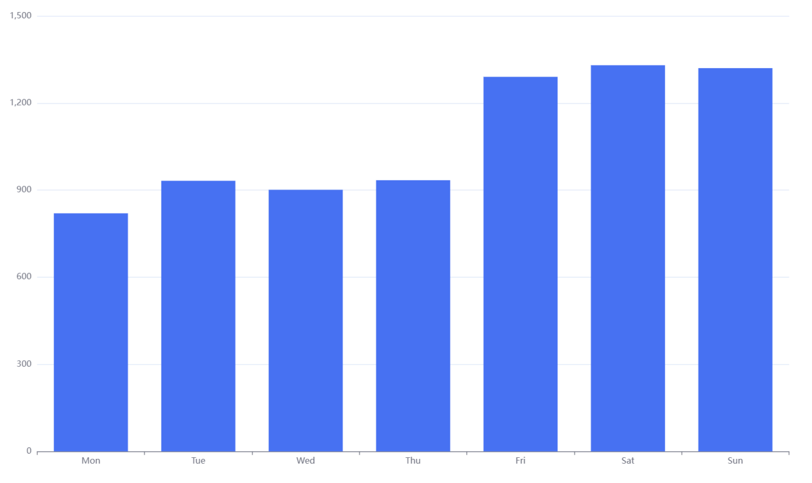


### 带背景色的柱状图

```html
<html lang="en">
<head>
    <meta charset="UTF-8">
    <title>带背景色的柱状图</title>

    <script src="./js/echarts.js"></script>

</head>

<style>
    #container {
        width: 70vw;
        height: 70vh;
        position: absolute;
        top: 50%;
        left: 50%;
        transform: translate(-50%, -50%);
    }
</style>
<body>
<div id="container"></div>
<script>
    //初始化echarts实例
    var chart = echarts.init(document.getElementById('container'));

    // 指定图表的配置项和数据
    var option =
        {
            xAxis: {
                type: 'category',
                data: ['Mon', 'Tue', 'Wed', 'Thu', 'Fri', 'Sat', 'Sun']
            },
            yAxis: {
                type: 'value'
            },
            series: [
                {
                    data: [820, 932, 901, 934, 1290, 1330, 1320],
                    type: 'bar',
                    showBackground: true,
                    backgroundStyle: {
                        color: 'rgba(180, 180, 180, 0.5)'
                    }
                }
            ]
        };

    //使用刚指定的配置项和数据显示图表
    chart.setOption(option);

</script>

</body>
</html>
```


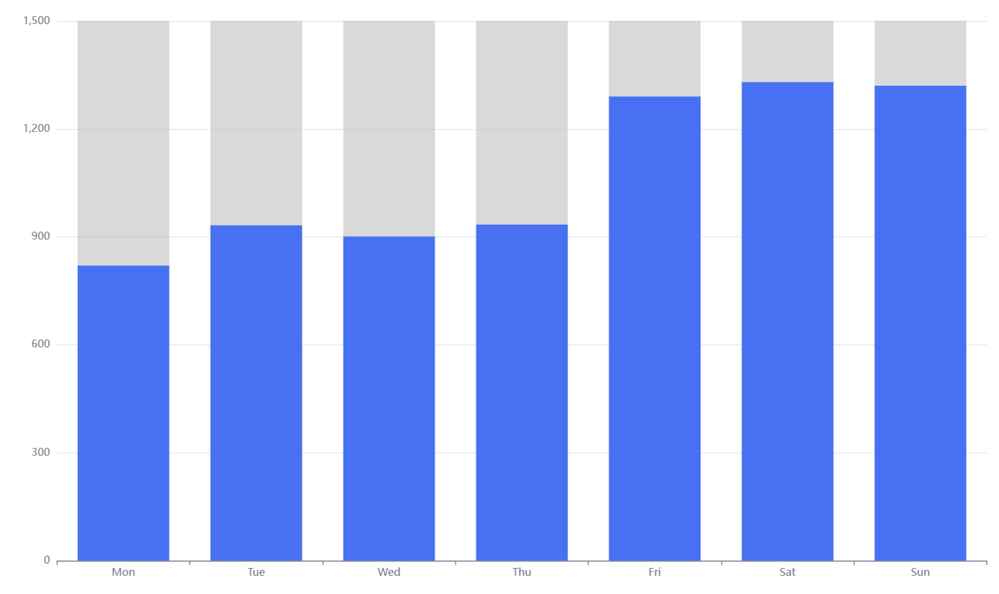


### 自定义单个柱子颜色

```html
<html lang="en">
<head>
    <meta charset="UTF-8">
    <title>自定义单个柱子颜色</title>

    <script src="./js/echarts.js"></script>

</head>

<style>
    #container {
        width: 70vw;
        height: 70vh;
        position: absolute;
        top: 50%;
        left: 50%;
        transform: translate(-50%, -50%);
    }
</style>
<body>
<div id="container"></div>
<script>
    //初始化echarts实例
    var chart = echarts.init(document.getElementById('container'));


    var seriesData = [
        120,
        200,
        160,
        80,
        70,
        110,
        130
    ]
    // 指定图表的配置项和数据
    var option =
        {
            xAxis: {
                type: 'category',
                data: ['Mon', 'Tue', 'Wed', 'Thu', 'Fri', 'Sat', 'Sun']
            },
            yAxis: {
                type: 'value'
            },
            series: [
                {
                    data: (function ()
                    {
                        let data1 = []
                        for (let i = 0; i < seriesData.length; i++)
                        {
                            if (seriesData[i] > 150)
                            {
                                data1.push(
                                    {
                                        value: seriesData[i],
                                        itemStyle: {
                                            color: '#ffaacc'
                                        }
                                    }
                                )
                            }
                            else if (seriesData[i]<75)
                            {
                                data1.push(
                                    {
                                        value: seriesData[i],
                                        itemStyle: {
                                            color: '#aadd00'
                                        }
                                    }
                                )
                            }
                            else
                            {
                                data1.push(seriesData[i])
                            }
                        }
                        console.log(data1)
                        return data1;
                    }()),
                    type: 'bar'
                }
            ]
        };

    //使用刚指定的配置项和数据显示图表
    chart.setOption(option);

</script>

</body>
</html>
```


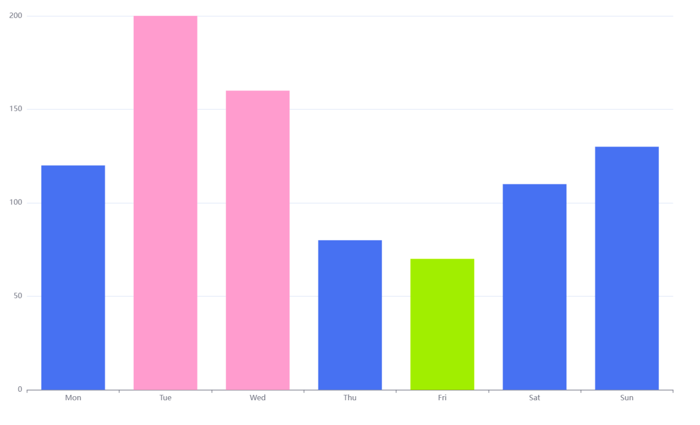


### 堆叠柱状图

```html
<html lang="en">
<head>
    <meta charset="UTF-8">
    <title>堆叠柱状图</title>

    <script src="./js/echarts.js"></script>

</head>

<style>
    #container {
        width: 70vw;
        height: 70vh;
        position: absolute;
        top: 50%;
        left: 50%;
        transform: translate(-50%, -50%);
    }
</style>
<body>
<div id="container"></div>
<script>
    //初始化echarts实例
    var chart = echarts.init(document.getElementById('container'));

    // 指定图表的配置项和数据
    var option =
        {
            xAxis: {
                type: 'category',
                data: ['Mon', 'Tue', 'Wed', 'Thu', 'Fri', 'Sat', 'Sun']
            },
            yAxis: {
                type: 'value'
            },
            legend: {
                data: ['柱状图1', '柱状图2', '柱状图3']
            },
            tooltip: {
                trigger: 'axis',
                axisPointer: {
                    type: 'shadow'
                }
            },
            series: [
                {
                    data: [820, 932, 901, 545, 1290, 1330, 1320],
                    type: 'bar',
                    name: "柱状图1"
                },
                {
                    data: [567, 932, 901, 934, 456, 475, 758],
                    type: 'bar',
                    name: "柱状图2"
                },
                {
                    data: [566, 586, 901, 934, 425, 477, 457],
                    type: 'bar',
                    name: "柱状图3"
                }
            ]
        };

    //使用刚指定的配置项和数据显示图表
    chart.setOption(option);

</script>

</body>
</html>
```


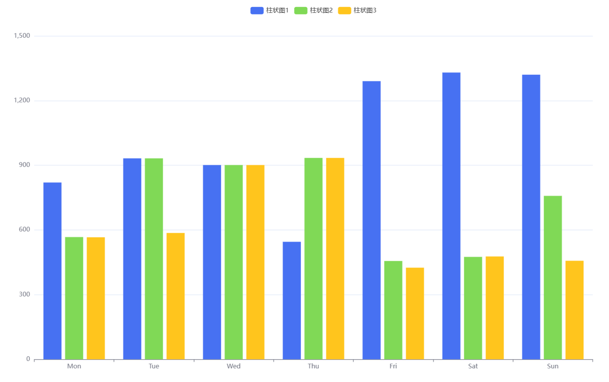


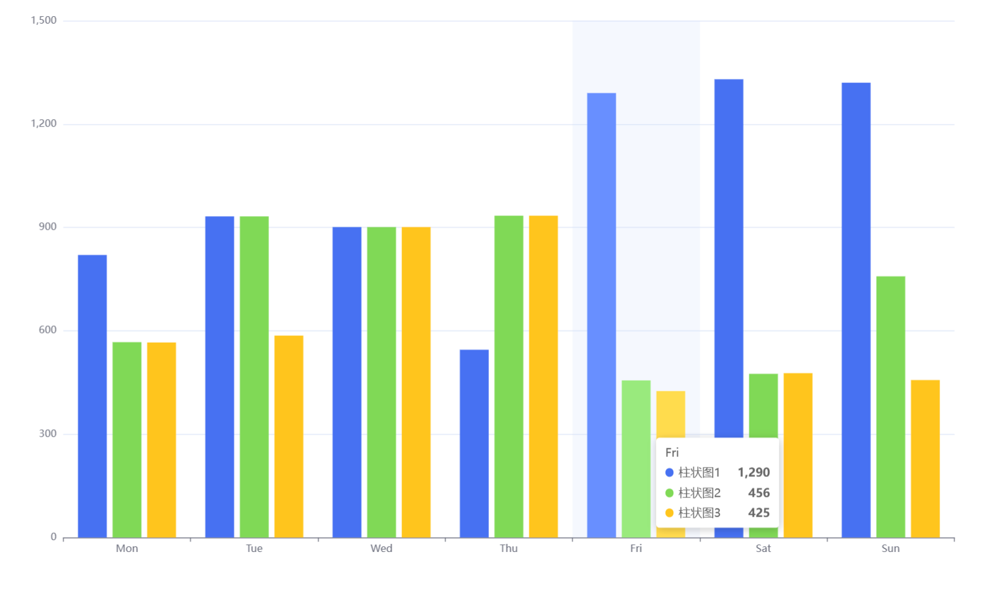

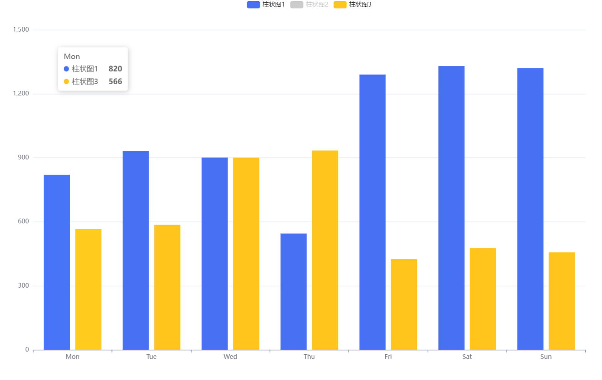


### 堆叠柱状图-focus

```html
<html lang="en">
<head>
    <meta charset="UTF-8">
    <title>堆叠柱状图</title>

    <script src="./js/echarts.js"></script>

</head>

<style>
    #container {
        width: 70vw;
        height: 70vh;
        position: absolute;
        top: 50%;
        left: 50%;
        transform: translate(-50%, -50%);
    }
</style>
<body>
<div id="container"></div>
<script>
    //初始化echarts实例
    var chart = echarts.init(document.getElementById('container'));

    // 指定图表的配置项和数据
    var option =
        {
            xAxis: {
                type: 'category',
                data: ['Mon', 'Tue', 'Wed', 'Thu', 'Fri', 'Sat', 'Sun']
            },
            yAxis: {
                type: 'value'
            },
            legend: {
                data: ['柱状图1', '柱状图2', '柱状图3']
            },
            tooltip: {
                trigger: 'axis',
                axisPointer: {
                    type: 'shadow'
                }
            },
            series: [
                {
                    data: [820, 932, 801, 545, 1290, 1330, 1320],
                    type: 'bar',
                    emphasis: {
                        focus: 'series'
                    },
                    name: "柱状图1"
                },
                {
                    data: [567, 932, 587, 934, 456, 475, 758],
                    type: 'bar',
                    emphasis: {
                        focus: 'series'
                    },
                    name: "柱状图2"
                },
                {
                    data: [566, 586, 901, 934, 425, 477, 457],
                    type: 'bar',
                    emphasis: {
                        focus: 'series'
                    },
                    name: "柱状图3"
                }
            ]
        };

    //使用刚指定的配置项和数据显示图表
    chart.setOption(option);

</script>

</body>
</html>
```


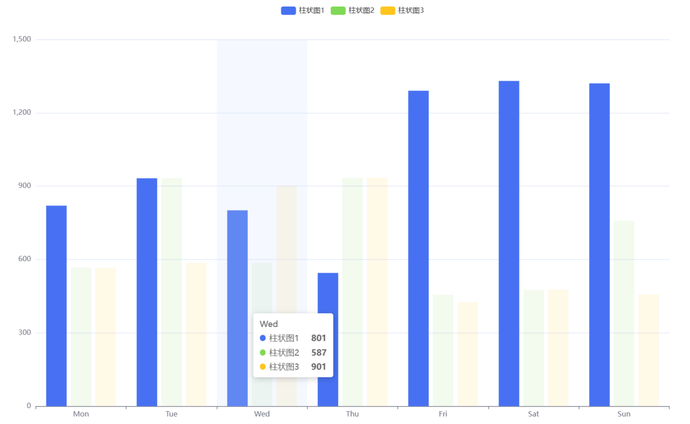


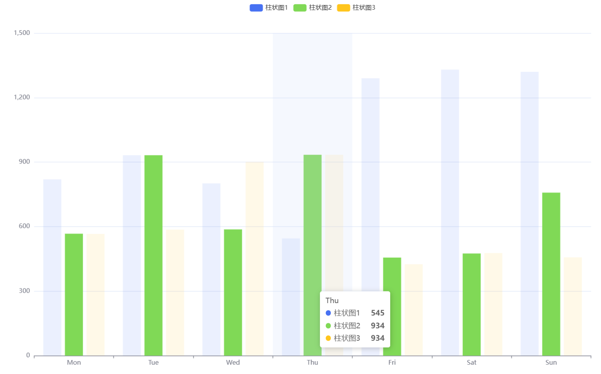


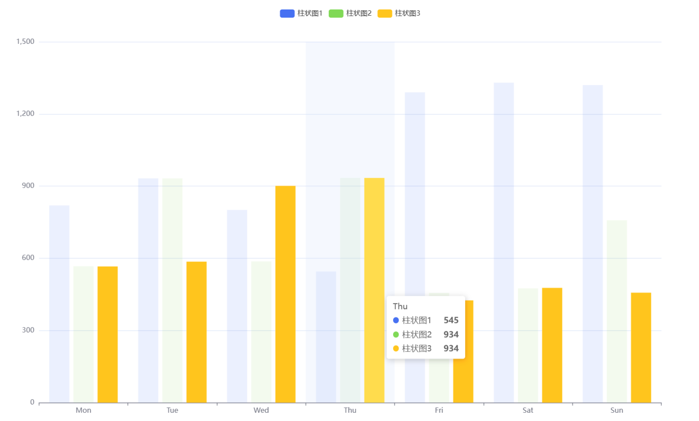


### 多数值轴轴缩放

```html
<html lang="en">
<head>
    <meta charset="UTF-8">
    <title>多数值轴轴缩放</title>

    <script src="./js/echarts.js"></script>

</head>

<style>
    #container {
        width: 70vw;
        height: 70vh;
        position: absolute;
        top: 50%;
        left: 50%;
        transform: translate(-50%, -50%);
    }
</style>
<body>
<div id="container"></div>
<script>
    //初始化echarts实例
    var chart = echarts.init(document.getElementById('container'));


    function getXAxisData()
    {
        let data = []
        for (let i = 0; i < 1000; i++)
        {
            data.push(i);
        }
        return data;
    }

    function getYSeriesData()
    {
        let data = []
        for (let i = 0; i < 1000; i++)
        {
            data.push(Math.round(Math.random() * 200) + 200);
        }
        return data;
    }

    // 指定图表的配置项和数据
    var option =
        {
            xAxis: {
                type: 'category',
                data: (getXAxisData())
            },
            yAxis: {
                type: 'value'
            },
            legend: {
                data: ['柱状图1', '柱状图2', '柱状图3']
            },
            tooltip: {
                trigger: 'axis',
                axisPointer: {
                    type: 'shadow'
                }
            },
            dataZoom: [
                {
                    show: true,
                    start: 94,
                    end: 100
                },
                {
                    type: 'inside',
                    start: 94,
                    end: 100
                },
                {
                    show: true,
                    yAxisIndex: 0,
                    filterMode: 'empty',
                    width: 30,
                    height: '80%',
                    showDataShadow: false,
                    left: '93%'
                }
            ],
            series: [
                {
                    data: getYSeriesData(),
                    type: 'bar',
                    emphasis: {
                        focus: 'series'
                    },
                    name: "柱状图1"
                },
                {
                    data: getYSeriesData(),
                    type: 'bar',
                    emphasis: {
                        focus: 'series'
                    },
                    name: "柱状图2"
                },
                {
                    data: getYSeriesData(),
                    type: 'bar',
                    emphasis: {
                        focus: 'series'
                    },
                    name: "柱状图3"
                }
            ]
        };

    //使用刚指定的配置项和数据显示图表
    chart.setOption(option);

</script>

</body>
</html>
```


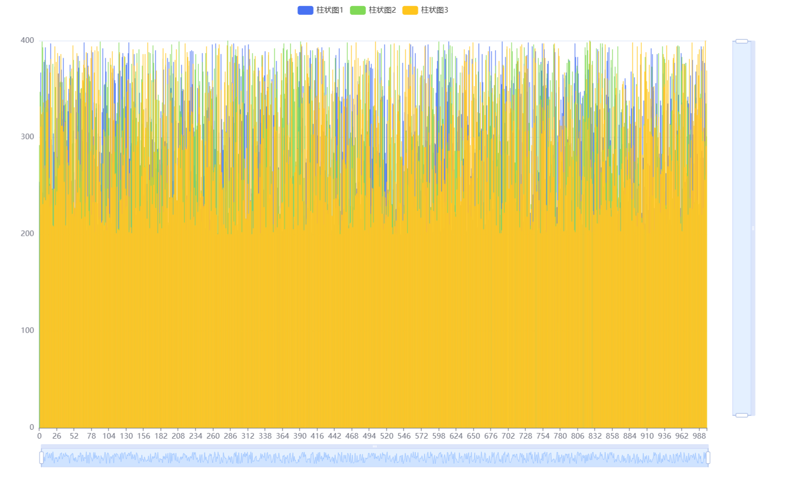


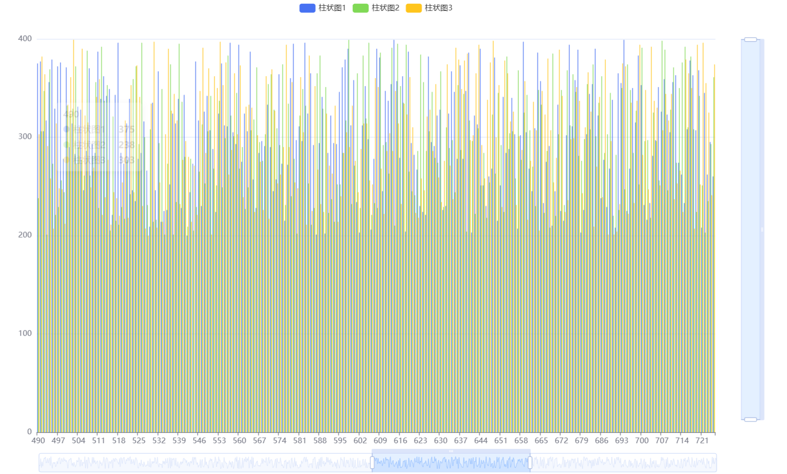


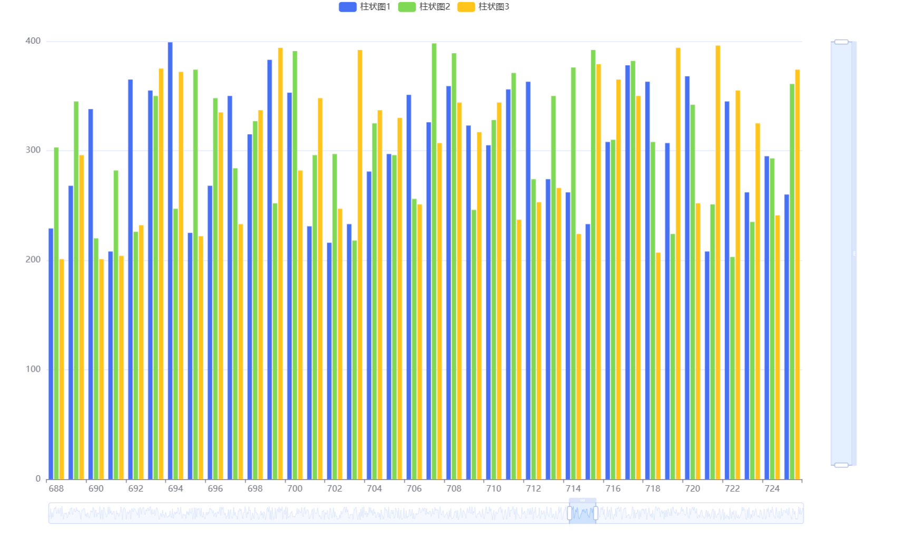


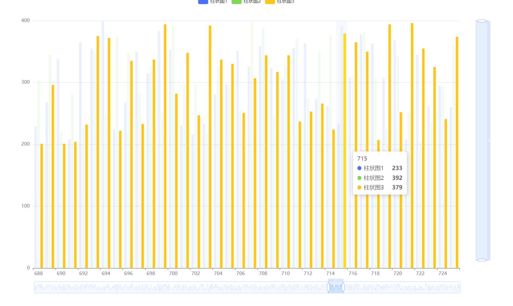


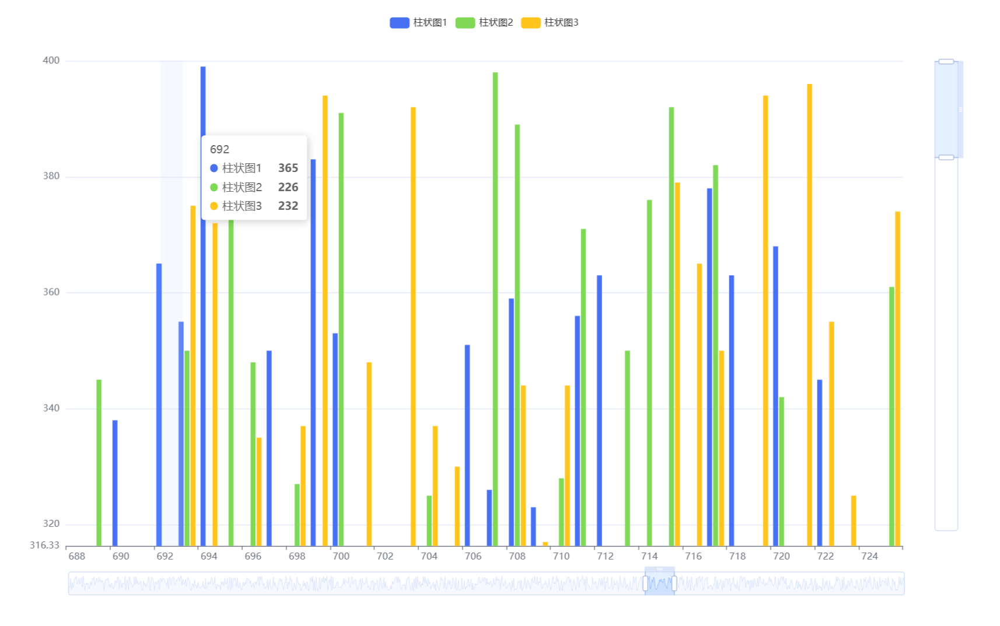


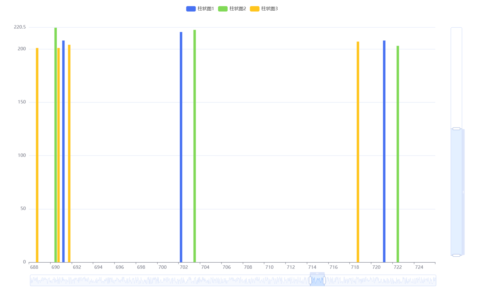


### 柱状图动画延迟

```html
<html lang="en">
<head>
    <meta charset="UTF-8">
    <title>柱状图动画延迟</title>

    <script src="./js/echarts.js"></script>

</head>

<style>
    #container {
        width: 70vw;
        height: 70vh;
        position: absolute;
        top: 50%;
        left: 50%;
        transform: translate(-50%, -50%);
    }
</style>
<body>
<div id="container"></div>
<script>
    //初始化echarts实例
    var chart = echarts.init(document.getElementById('container'));


    function getXAxisData()
    {
        let data = []
        for (let i = 0; i < 1000; i++)
        {
            data.push(i);
        }
        return data;
    }

    function getYSeriesData()
    {
        let data = []
        for (let i = 0; i < 1000; i++)
        {
            data.push(Math.round(Math.random() * 200) + 200);
        }
        return data;
    }

    // 指定图表的配置项和数据
    var option =
        {
            xAxis: {
                type: 'category',
                data: (getXAxisData())
            },
            yAxis: {
                type: 'value'
            },
            legend: {
                data: ['柱状图1', '柱状图2', '柱状图3']
            },
            tooltip: {
                trigger: 'axis',
                axisPointer: {
                    type: 'shadow'
                }
            },
            dataZoom: [
                {
                    show: true,
                    start: 94,
                    end: 100
                },
                {
                    type: 'inside',
                    start: 94,
                    end: 100
                },
                {
                    show: true,
                    yAxisIndex: 0,
                    filterMode: 'empty',
                    width: 30,
                    height: '80%',
                    showDataShadow: false,
                    left: '93%'
                }
            ],
            series: [
                {
                    data: getYSeriesData(),
                    type: 'bar',
                    emphasis: {
                        focus: 'series'
                    },
                    animationEasing: 'elasticOut',
                    animationDelay: function (idx)
                    {
                        return idx * 10;
                    },
                    name: "柱状图1"
                },
                {
                    data: getYSeriesData(),
                    type: 'bar',
                    emphasis: {
                        focus: 'series'
                    },
                    animationEasing: 'elasticOut',
                    animationDelay: function (idx)
                    {
                        return idx * 20;
                    },
                    name: "柱状图2"
                },
                {
                    data: getYSeriesData(),
                    type: 'bar',
                    emphasis: {
                        focus: 'series'
                    },
                    animationEasing: 'elasticOut',
                    animationDelay: function (idx)
                    {
                        return idx * 30;
                    },
                    name: "柱状图3"
                }
            ]
        };

    //使用刚指定的配置项和数据显示图表
    chart.setOption(option);

</script>

</body>
</html>
```


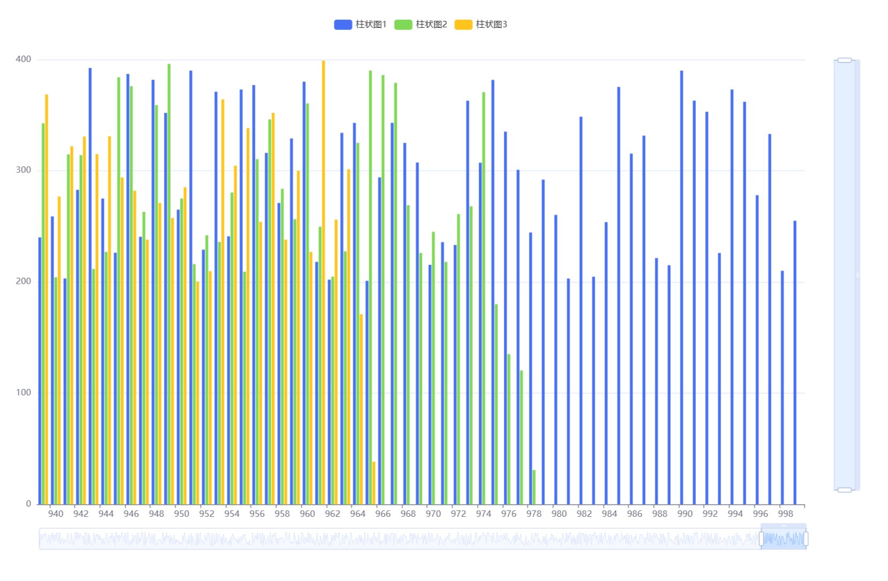


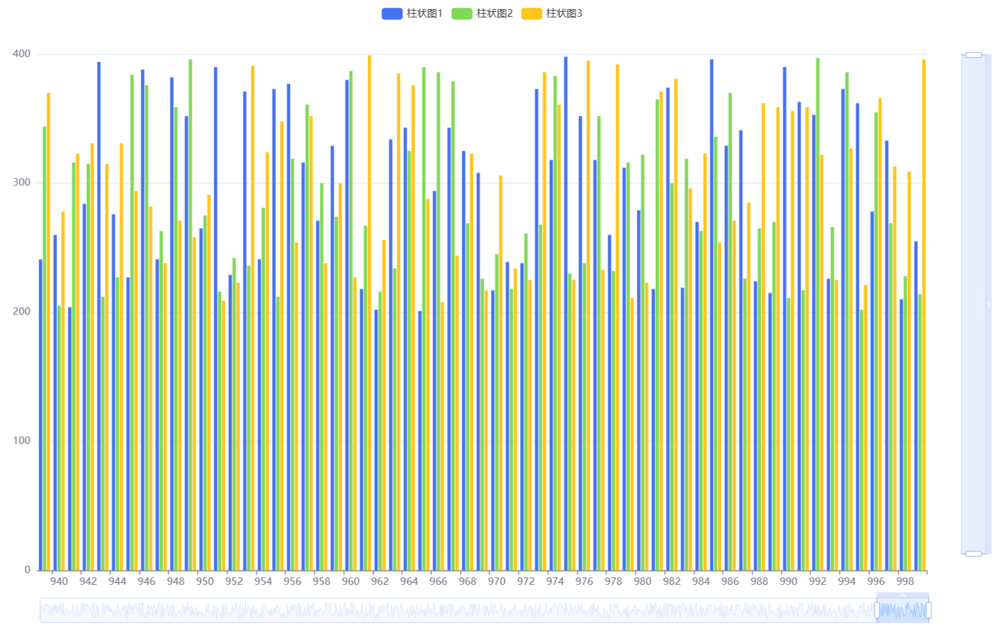


### 动态排序柱状图

```html
<html lang="en">
<head>
    <meta charset="UTF-8">
    <title>动态排序柱状图</title>

    <script src="./js/echarts.js"></script>

</head>

<style>
    #container {
        width: 70vw;
        height: 70vh;
        position: absolute;
        top: 50%;
        left: 50%;
        transform: translate(-50%, -50%);
    }
</style>
<body>
<div id="container"></div>
<script>
    //初始化echarts实例
    var chart = echarts.init(document.getElementById('container'));

    const data = [];
    for (let i = 0; i < 5; ++i)
    {
        data.push(Math.round(Math.random() * 200));
    }
    // 指定图表的配置项和数据
    var option =
        {
            xAxis: {
                max: 'dataMax'
            },
            yAxis: {
                type: 'category',
                data: ['A', 'B', 'C', 'D', 'E'],
                inverse: true,
                animationDuration: 300,
                animationDurationUpdate: 300,
                max: 2 // only the largest 3 bars will be displayed
            },
            series: [
                {
                    realtimeSort: true,
                    name: 'X',
                    type: 'bar',
                    data: data,
                    label: {
                        show: true,
                        position: 'right',
                        valueAnimation: true
                    }
                }
            ],
            legend: {
                show: true
            },
            animationDuration: 0,
            animationDurationUpdate: 3000,
            animationEasing: 'linear',
            animationEasingUpdate: 'linear'
        };

    //使用刚指定的配置项和数据显示图表
    chart.setOption(option);

    function run()
    {
        for (var i = 0; i < data.length; ++i)
        {
            if (Math.random() > 0.9)
            {
                data[i] += Math.round(Math.random() * 2000);
            }
            else
            {
                data[i] += Math.round(Math.random() * 200);
            }
        }
        chart.setOption({
            series: [
                {
                    type: 'bar',
                    data
                }
            ]
        });
    }

    setTimeout(function ()
    {
        run();
    }, 0);
    setInterval(function ()
    {
        run();
    }, 3000);

</script>

</body>
</html>
```


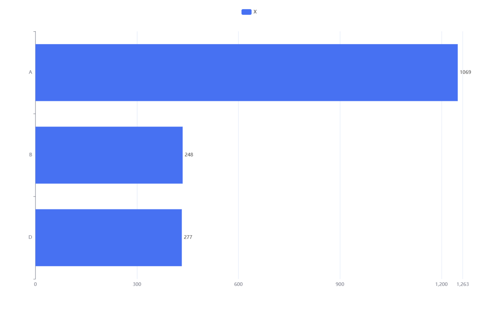


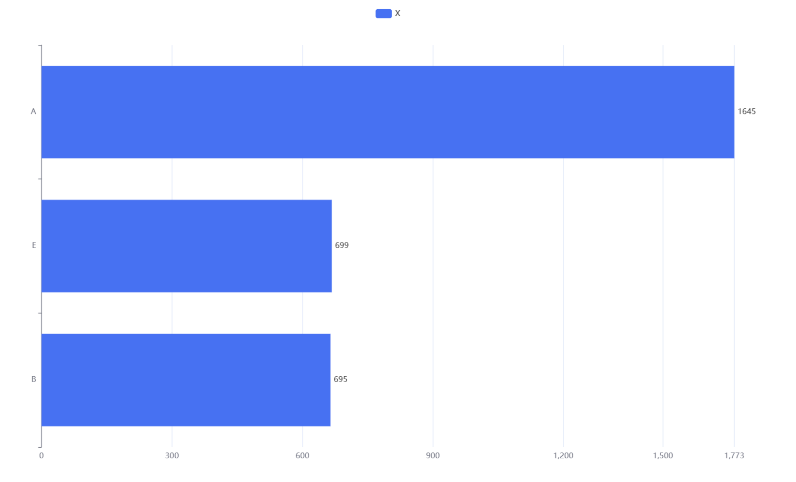


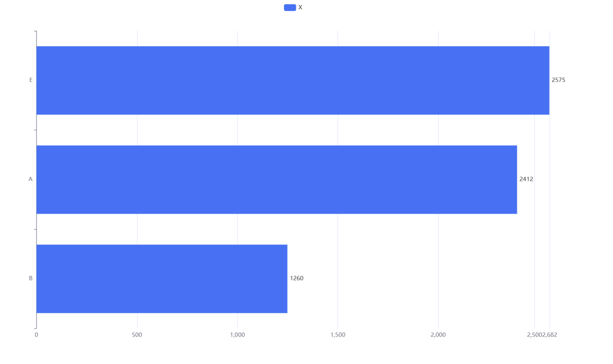


### 排序柱状图

```html
<html lang="en">
<head>
    <meta charset="UTF-8">
    <title>排序柱状图</title>

    <script src="./js/echarts.js"></script>

</head>

<style>
    #container {
        width: 70vw;
        height: 70vh;
        position: absolute;
        top: 50%;
        left: 50%;
        transform: translate(-50%, -50%);
    }
</style>
<body>
<div id="container"></div>
<script>
    //初始化echarts实例
    var chart = echarts.init(document.getElementById('container'));
    

    // 指定图表的配置项和数据
    var option =
        {
            dataset: [
                {
                    dimensions: ['name', 'age', 'profession', 'score', 'date'],
                    source: [
                        ['Hannah Krause', 41, 'Engineer', 314, '2011-02-12'],
                        ['Zhao Qian', 20, 'Teacher', 351, '2011-03-01'],
                        ['Jasmin Krause ', 52, 'Musician', 287, '2011-02-14'],
                        ['Li Lei', 37, 'Teacher', 219, '2011-02-18'],
                        ['Karle Neumann', 25, 'Engineer', 253, '2011-04-02'],
                        ['Adrian Groß', 19, 'Teacher', '-', '2011-01-16'],
                        ['Mia Neumann', 71, 'Engineer', 165, '2011-03-19'],
                        ['Böhm Fuchs', 36, 'Musician', 318, '2011-02-24'],
                        ['Han Meimei', 67, 'Engineer', 366, '2011-03-12']
                    ]
                },
                {
                    transform: {
                        type: 'sort',
                        config: { dimension: 'score', order: 'desc' }
                    }
                }
            ],
            xAxis: {
                type: 'category',
                axisLabel: { interval: 0, rotate: 30 }
            },
            yAxis: {},
            series: {
                type: 'bar',
                encode: { x: 'name', y: 'score' },
                datasetIndex: 1
            }
        };

    //使用刚指定的配置项和数据显示图表
    chart.setOption(option);

</script>

</body>
</html>
```


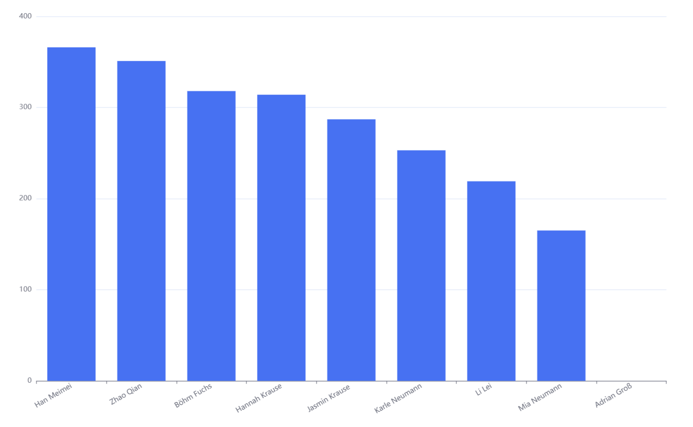


### 条形图

```html
<html lang="en">
<head>
    <meta charset="UTF-8">
    <title>基础条形图</title>

    <script src="./js/echarts.js"></script>

</head>

<style>
    #container {
        width: 70vw;
        height: 70vh;
        position: absolute;
        top: 50%;
        left: 50%;
        transform: translate(-50%, -50%);
    }
</style>
<body>
<div id="container"></div>
<script>
    //初始化echarts实例
    var chart = echarts.init(document.getElementById('container'));

    // 指定图表的配置项和数据
    var option =
        {
            yAxis: {
                type: 'category',
                data: ['Mon', 'Tue', 'Wed', 'Thu', 'Fri', 'Sat', 'Sun']
            },
            xAxis: {
                type: 'value'
            },
            tooltip: {
                trigger: 'axis',
                axisPointer: {
                    type: 'shadow'
                }
            },
            legend: {},
            series: [
                {
                    data: [820, 932, 901, 934, 1290, 1330, 1320],
                    type: 'bar',
                    areaStyle: {}
                }
            ]
        };

    //使用刚指定的配置项和数据显示图表
    chart.setOption(option);

</script>

</body>
</html>
```


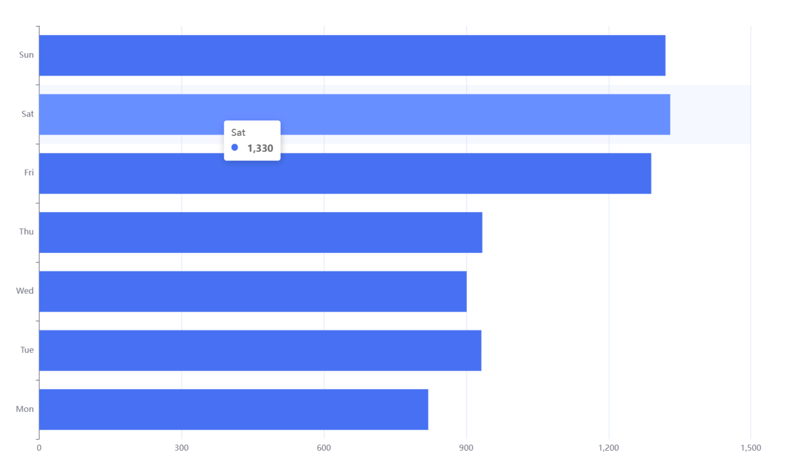


### 堆叠条形图

```html
<html lang="en">
<head>
    <meta charset="UTF-8">
    <title>堆叠条形图</title>

    <script src="./js/echarts.js"></script>

</head>

<style>
    #container {
        width: 70vw;
        height: 70vh;
        position: absolute;
        top: 50%;
        left: 50%;
        transform: translate(-50%, -50%);
    }
</style>
<body>
<div id="container"></div>
<script>
    //初始化echarts实例
    var chart = echarts.init(document.getElementById('container'));

    // 指定图表的配置项和数据
    var option =
        {
            tooltip: {
                trigger: 'axis',
                axisPointer: {
                    // Use axis to trigger tooltip
                    type: 'shadow' // 'shadow' as default; can also be 'line' or 'shadow'
                }
            },
            legend: {},
            grid: {
                left: '3%',
                right: '4%',
                bottom: '3%',
                containLabel: true
            },
            xAxis: {
                type: 'value'
            },
            yAxis: {
                type: 'category',
                data: ['Mon', 'Tue', 'Wed', 'Thu', 'Fri', 'Sat', 'Sun']
            },
            series: [
                {
                    name: 'Direct',
                    type: 'bar',
                    stack: 'total',
                    label: {
                        show: true
                    },
                    emphasis: {
                        focus: 'series'
                    },
                    data: [320, 302, 301, 334, 390, 330, 320]
                },
                {
                    name: 'Mail Ad',
                    type: 'bar',
                    stack: 'total',
                    label: {
                        show: true
                    },
                    emphasis: {
                        focus: 'series'
                    },
                    data: [120, 132, 101, 134, 90, 230, 210]
                },
                {
                    name: 'Affiliate Ad',
                    type: 'bar',
                    stack: 'total',
                    label: {
                        show: true
                    },
                    emphasis: {
                        focus: 'series'
                    },
                    data: [220, 182, 191, 234, 290, 330, 310]
                },
                {
                    name: 'Video Ad',
                    type: 'bar',
                    stack: 'total',
                    label: {
                        show: true
                    },
                    emphasis: {
                        focus: 'series'
                    },
                    data: [150, 212, 201, 154, 190, 330, 410]
                },
                {
                    name: 'Search Engine',
                    type: 'bar',
                    stack: 'total',
                    label: {
                        show: true
                    },
                    emphasis: {
                        focus: 'series'
                    },
                    data: [820, 832, 901, 934, 1290, 1330, 1320]
                }
            ]
        };

    //使用刚指定的配置项和数据显示图表
    chart.setOption(option);

</script>

</body>
</html>
```


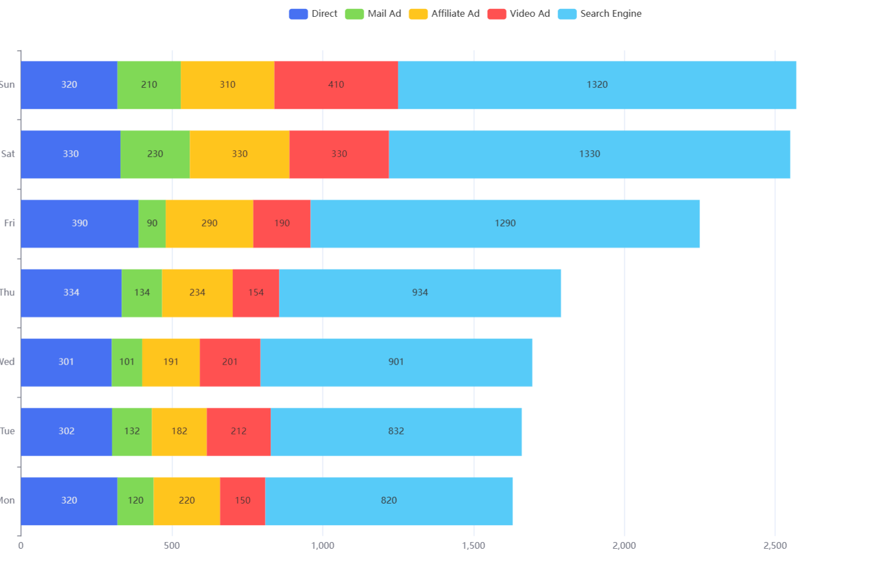


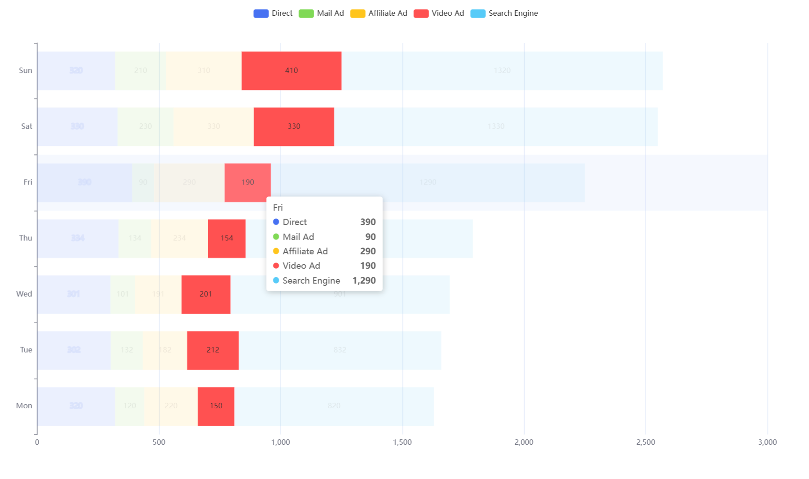


